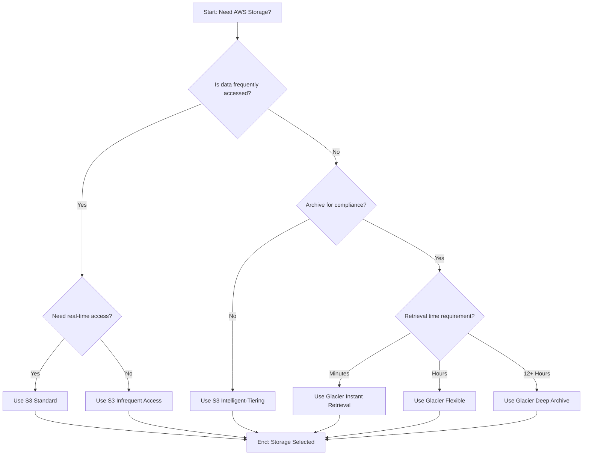
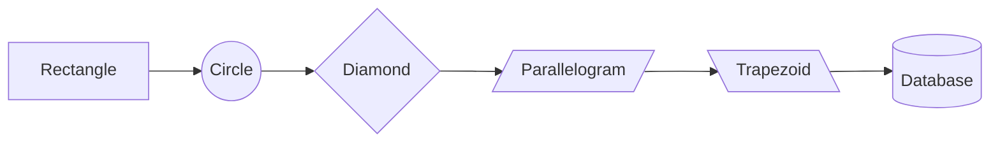

# Mermaid Decision Tree Example

## Simple Decision Tree

## Key Syntax Elements

- `graph TD` - Top Down flow (can also use LR for Left-Right)
- `[Rectangle]` - Regular node with text
- `{Diamond}` - Decision node (rhombus shape)
- `-->` - Arrow connector
- `-->|Label|` - Arrow with label text
- Letters (A, B, C) - Node IDs for referencing

## Other Common Shapes

