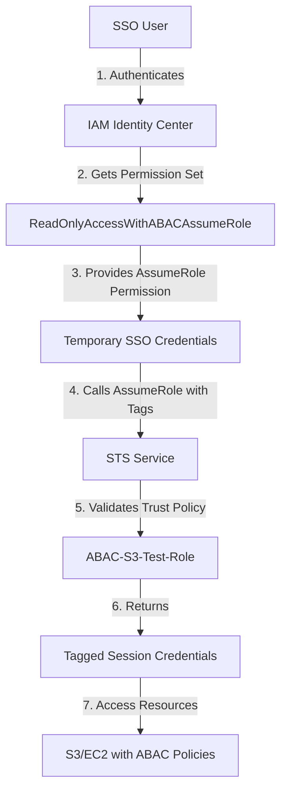

# AWS SSO to ABAC Role Assumption: Complete Setup Guide

## Table of Contents
1. [Architecture Overview](#architecture-overview)
2. [Components Breakdown](#components-breakdown)
3. [Setup Sequence](#setup-sequence)
4. [How Tags Flow Through the Process](#how-tags-flow-through-the-process)
5. [Step-by-Step Implementation](#step-by-step-implementation)
6. [Testing the Setup](#testing-the-setup)
7. [Security Considerations](#security-considerations)

## Architecture Overview

This guide explains how to set up AWS IAM Identity Center (SSO) users to assume IAM roles with session tags for Attribute-Based Access Control (ABAC). This pattern enables fine-grained access control based on user attributes and session tags.



## Components Breakdown

### 1. IAM Identity Center Permission Set: `ReadOnlyAccessWithABACAssumeRole`

**Purpose**: Grants SSO users the ability to assume specific IAM roles with session tags.

**Configuration**:
- **Managed Policy**: `arn:aws:iam::aws:policy/ReadOnlyAccess`
- **Session Duration**: 12 hours
- **Inline Policy**:
```json
{
    "Version": "2012-10-17",
    "Statement": [
        {
            "Sid": "Statement1",
            "Effect": "Allow",
            "Action": [
                "sts:AssumeRole",
                "sts:TagSession"
            ],
            "Resource": [
                "arn:aws:iam::123456789012:role/ABAC-S3-Test-Role"
            ]
        }
    ]
}
```

**Key Points**:
- `sts:AssumeRole`: Allows the user to assume the specified role
- `sts:TagSession`: Allows the user to pass session tags when assuming the role
- Resource is limited to specific role(s) for security

### 2. IAM Role: `ABAC-S3-Test-Role`

**Purpose**: The target role that SSO users will assume, configured for ABAC.

**Trust Policy (Who can assume this role)**:
```json
{
    "Version": "2012-10-17",
    "Statement": [
        {
            "Sid": "AllowAccountAndEC2Access",
            "Effect": "Allow",
            "Principal": {
                "AWS": "arn:aws:iam::123456789012:root",
                "Service": "ec2.amazonaws.com"
            },
            "Action": [
                "sts:AssumeRole",
                "sts:TagSession"
            ]
        },
        {
            "Sid": "AllowSAMLAccess",
            "Effect": "Allow",
            "Principal": {
                "Federated": "arn:aws:iam::123456789012:saml-provider/IdentityCenter"
            },
            "Action": [
                "sts:AssumeRoleWithSAML",
                "sts:TagSession"
            ],
            "Condition": {
                "StringEquals": {
                    "SAML:aud": "https://signin.aws.amazon.com/saml"
                }
            }
        }
    ]
}
```

**Attached Managed Policies**:
- `arn:aws:iam::aws:policy/AmazonEC2ReadOnlyAccess`
- `arn:aws:iam::aws:policy/AmazonS3ReadOnlyAccess`

## Setup Sequence

### Phase 1: IAM Identity Center Configuration
1. Create IAM Identity Center instance
2. Create users (e.g., test-user-1, test-user-2)
3. Create permission set with AssumeRole permissions
4. Assign permission set to users/groups

### Phase 2: IAM Role Configuration
1. Create the target IAM role
2. Configure trust policy to allow assumption from:
   - AWS account principals
   - IAM Identity Center (SAML provider)
   - EC2 service (if needed)
3. Attach necessary permission policies
4. Enable session tagging in trust policy

### Phase 3: Permission Alignment
1. Ensure permission set has `sts:TagSession` permission
2. Ensure role trust policy allows `sts:TagSession` action
3. Configure ABAC policies on resources (S3, EC2, etc.)

## How Tags Flow Through the Process

### 1. **Initial SSO Authentication**
```bash
aws sso login --profile test-user-1
```
- User authenticates with IAM Identity Center
- Receives temporary credentials based on permission set
- These credentials include the permission to assume roles and tag sessions

### 2. **Role Assumption with Session Tags**
```bash
aws sts assume-role \
    --role-arn arn:aws:iam::123456789012:role/ABAC-S3-Test-Role \
    --role-session-name test-user-1-test \
    --tags Key=username_owner,Value=test-user-1 \
           Key=sample_access_flag_A,Value=true \
    --profile test-user-1
```

### 3. **Tag Propagation**
The session tags become part of the temporary credentials and are evaluated by ABAC policies:

```
Principal Tags Available in Session:
- aws:PrincipalTag/username_owner = "test-user-1"
- aws:PrincipalTag/sample_access_flag_A = "true"
```

### 4. **Resource Access with ABAC**
Resources with ABAC policies evaluate these tags:
```json
{
    "Condition": {
        "StringEquals": {
            "s3:ExistingObjectTag/owner": "${aws:PrincipalTag/username_owner}"
        }
    }
}
```

## Step-by-Step Implementation

### Step 1: Create the IAM Role
```bash
# Create role with trust policy
aws iam create-role \
    --role-name ABAC-S3-Test-Role \
    --assume-role-policy-document file://ABAC-S3-Test-Role-trust.json \
    --profile example-admin-profile

# Attach managed policies
aws iam attach-role-policy \
    --role-name ABAC-S3-Test-Role \
    --policy-arn arn:aws:iam::aws:policy/AmazonS3ReadOnlyAccess \
    --profile example-admin-profile
```

### Step 2: Create IAM Identity Center Permission Set
```bash
# Get IAM Identity Center instance ARN
INSTANCE_ARN=$(aws sso-admin list-instances \
    --query 'Instances[0].InstanceArn' \
    --output text \
    --profile example-admin-profile)

# Create permission set
aws sso-admin create-permission-set \
    --instance-arn $INSTANCE_ARN \
    --name ReadOnlyAccessWithABACAssumeRole \
    --description "Read-only access with ABAC role assumption" \
    --session-duration PT12H \
    --profile example-admin-profile
```

### Step 3: Configure Permission Set Policies
```bash
# Attach AWS managed policy
aws sso-admin attach-managed-policy-to-permission-set \
    --instance-arn $INSTANCE_ARN \
    --permission-set-arn $PERMISSION_SET_ARN \
    --managed-policy-arn arn:aws:iam::aws:policy/ReadOnlyAccess \
    --profile example-admin-profile

# Add inline policy for AssumeRole
aws sso-admin put-inline-policy-to-permission-set \
    --instance-arn $INSTANCE_ARN \
    --permission-set-arn $PERMISSION_SET_ARN \
    --inline-policy file://ReadOnlyAccessWithABACAssumeRole-inline.json \
    --profile example-admin-profile
```

### Step 4: Assign Permission Set to Users
```bash
# Assign to user or group
aws sso-admin create-account-assignment \
    --instance-arn $INSTANCE_ARN \
    --permission-set-arn $PERMISSION_SET_ARN \
    --principal-id <USER_OR_GROUP_ID> \
    --principal-type USER \
    --target-id 123456789012 \
    --target-type AWS_ACCOUNT \
    --profile example-admin-profile
```

## Testing the Setup

### 1. Configure AWS CLI for SSO User
```bash
aws configure sso
# Follow prompts to set up profile
```

### 2. Test Basic SSO Access
```bash
# Login
aws sso login --profile test-user-1

# Verify access
aws sts get-caller-identity --profile test-user-1
```

### 3. Test Role Assumption without Tags
```bash
aws sts assume-role \
    --role-arn arn:aws:iam::123456789012:role/ABAC-S3-Test-Role \
    --role-session-name test-session \
    --profile test-user-1
```

### 4. Test Role Assumption with Session Tags
```bash
# Assume role with tags
CREDS=$(aws sts assume-role \
    --role-arn arn:aws:iam::123456789012:role/ABAC-S3-Test-Role \
    --role-session-name test-user-1-abac \
    --tags Key=username_owner,Value=test-user-1 \
           Key=department,Value=engineering \
           Key=project,Value=alpha \
    --query 'Credentials.[AccessKeyId,SecretAccessKey,SessionToken]' \
    --output text \
    --profile test-user-1)

# Export credentials
export AWS_ACCESS_KEY_ID=$(echo $CREDS | cut -d' ' -f1)
export AWS_SECRET_ACCESS_KEY=$(echo $CREDS | cut -d' ' -f2)
export AWS_SESSION_TOKEN=$(echo $CREDS | cut -d' ' -f3)

# Test access with tagged session
aws sts get-caller-identity
```

### 5. Verify ABAC Access to Resources
```bash
# List S3 objects (will be filtered by ABAC policies)
aws s3 ls s3://bucket-name/

# Access will be granted/denied based on:
# - Object tags matching session tags
# - Bucket policies evaluating principal tags
```

## Security Considerations

### 1. **Why Both Policies Need `sts:TagSession`**

**In the Permission Set (Caller's Permission)**:
- Required for the SSO user to pass tags when calling AssumeRole
- Without this, the API call fails with "Access Denied"
- Controls what the caller can do

**In the Trust Policy (Role's Permission)**:
- Required for the role to accept tagged sessions
- Without this, the role refuses the assumption with tags
- Controls what the role accepts

### 2. **Principle of Least Privilege**
- Limit AssumeRole permission to specific roles only
- Never use `Resource: "*"` for AssumeRole permissions
- Restrict which tags can be passed using conditions

### 3. **Tag-Based Security**
```json
{
    "Condition": {
        "StringEquals": {
            "aws:RequestedRegion": "us-east-1",
            "sts:ExternalId": "unique-external-id"
        },
        "StringLike": {
            "aws:userid": "AIDAI*"
        }
    }
}
```

### 4. **Audit and Monitoring**
- CloudTrail logs all AssumeRole calls with tags
- Monitor for unusual tag patterns
- Set up CloudWatch alarms for privilege escalation attempts

### 5. **Tag Governance**
- Establish naming conventions for tags
- Document which tags control what access
- Implement tag policies in AWS Organizations

## Common Issues and Solutions

### Issue 1: "Invalid security token" after permission changes
**Solution**: Run `aws sso login --profile <profile-name>` again

### Issue 2: "Access Denied" when passing tags
**Causes**:
- Missing `sts:TagSession` in permission set
- Missing `sts:TagSession` in trust policy
- Tag key/value restrictions in policies

### Issue 3: ABAC policies not working
**Check**:
- Session tags are properly set
- Resource tags match expected values
- Policy conditions use correct tag references

## Example ABAC Policy for S3
```json
{
    "Version": "2012-10-17",
    "Statement": [
        {
            "Effect": "Allow",
            "Action": ["s3:GetObject"],
            "Resource": "arn:aws:s3:::my-bucket/*",
            "Condition": {
                "StringEquals": {
                    "s3:ExistingObjectTag/owner": "${aws:PrincipalTag/username_owner}",
                    "s3:ExistingObjectTag/department": "${aws:PrincipalTag/department}"
                }
            }
        }
    ]
}
```

## Conclusion

This setup enables:
1. **Centralized authentication** through IAM Identity Center
2. **Dynamic authorization** through session tags
3. **Fine-grained access control** through ABAC policies
4. **Scalable permissions** without policy proliferation

The key insight is that tags flow from the SSO user through the AssumeRole operation into the session, where they're evaluated by ABAC policies on resources. This creates a flexible, maintainable access control system that scales with your organization.